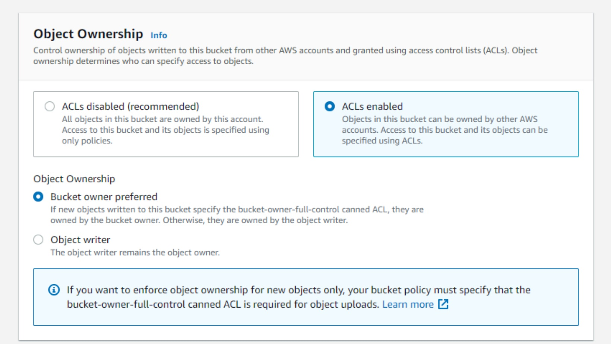
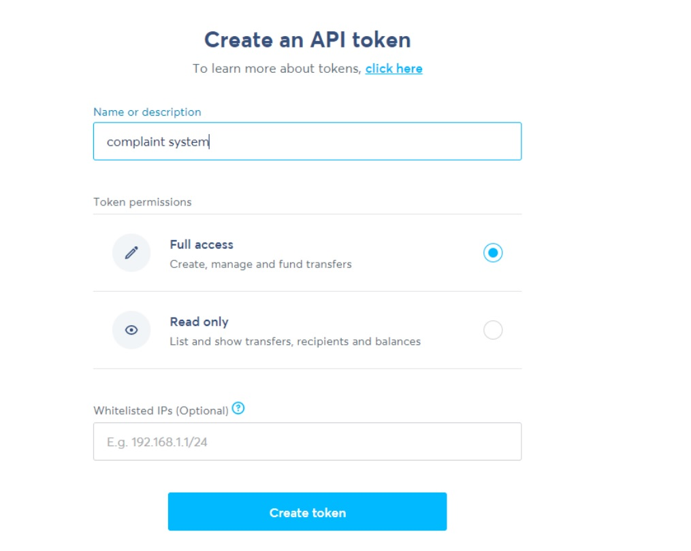

# Compaint System App + Emails + S3
## S3 AWS
- Зарегистрировать bucket на s3 aws, выбрать имя и регион
- Включите опцию ACLs 
- Измените bucket policy следующим образом:
```
{
    "Version": "2012-10-17",
    "Statement": [
        {
            "Sid": "PublicReadGetObject",
            "Effect": "Allow",
            "Principal": "*",
            "Action": "s3:GetObject",
            "Resource": "arn:aws:s3:::<project_name>/*"
        }
]
}
```
- В ACL(Access control List) установите 2 флага в разделе ```Everyone(public access)``` - List,Read
- Сгенерируйте секретные ключи доступа в разделе  ```My security credintials```
### Добавьте эти переменные в .env-non-dev
```
AWS_ACCESS_KEY="PASTE YOUR KEY"
AWS_SECRET="PASTE YOUR SECRET"
AWS_BUCKET="PASTE YOUR BUCKET NAME"
AWS_REGION="eu-central-1"
```
## Wise system
- Создайте профиль на [Wise](https://sandbox.transferwise.tech/register#/email)
- Получите API Token 
- Дайте название токену и установите полный доступ для выполнения всех операций: создание/отменение транкзаций, рефанд средств 
- Убедитесь что вы используете sandbox среду для виртуального обращения с виртуальными средствами :)
- Вставьте WISE_TOKEN в .env-non-dev
- ```WISE_TOKEN = 12345...```
## Запуск 
- Склонируйте репозиторий
```
https://github.com/qustoo/ComplaintSystemApp
```
- Заполните файл .env-non-dev переменными окружения
```
DB_USER = "user"
DB_PASS = "pass"
DB_HOST = "host"
DB_PORT = 123
DB_NAME = "database_name"
JWT_SECRET = "some jwt secret"
ALGORITHM = "HS256"
AWS_ACCESS_KEY = "XXXXXX"
AWS_SECRET_KEY = "XXXXXX"
AWS_BUCKET_NAME = "XXXXXX"
AWS_REGION = "eu-central-1"
WISE_TOKEN = "XXXXXX"
WISE_URL = "XXXXXX"
...
```
---
- Создайте виртуальное окружение, перейдите в него, и установите зависимости
```
make create_env
make install_depends
```
- Выполните миграции БД при помощи alembic
```
make migrate
```
- Форматеры,линтеры и сортировка импортов: 
```
make black flake8 isort
```
- Запуск на локальной машине
```
make run
```

## Documentation
- Swagger IU <http://localhost:8000/docs>

